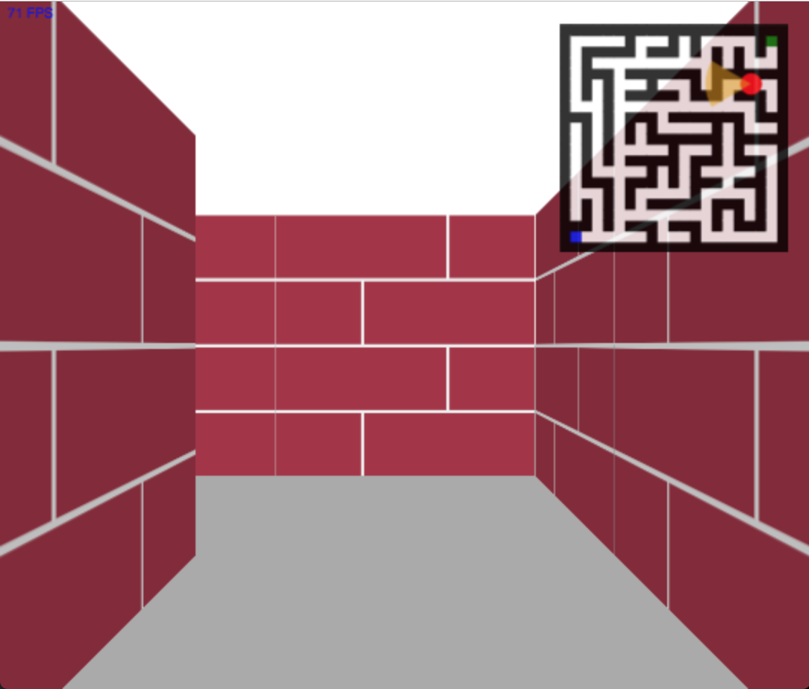

# README.md

Raycasting 3D renderer written in pure Javascript, generating and rendering a world similar to the classic Windows 95 maze screensaver. A maze is generated via randomized Prim's algorithm, and subsequently solved via a simple DFS pathfinding algorithm; the renderer shows the solution of the maze from a first person, tracing the entire DFS path.

